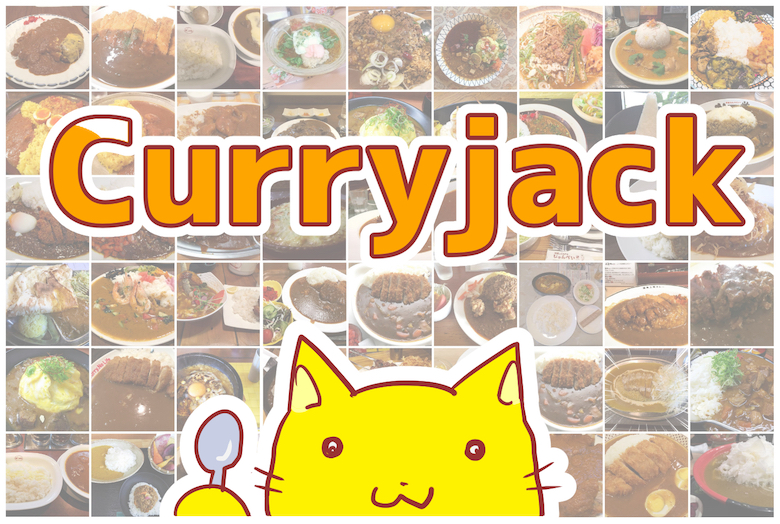

# Curryjack カレージャック

🍛 [Play in English](https://curryjack.zzzmisa.com/en/#/)  
🍛 [日本語で遊んでみる](https://curryjack.zzzmisa.com)

Curryjack is a game app using [Open Data Curry](https://www.facebook.com/opendatacurry/).  
カレージャックは、[#オープンデータカレー](https://www.facebook.com/opendatacurry/) を使ったゲームアプリです。

## System requirements

It is checked to work on the following browser's latest versions.

- PC: Google Chrome, Safari (Checked on Mac OS X)
- Mobile: iOS Safari

## Licence

- Source code: [MIT](https://github.com/zzzmisa/curryjack/blob/master/LICENSE)
- Curry data: See [Open Data Curry](https://www.facebook.com/opendatacurry/)
